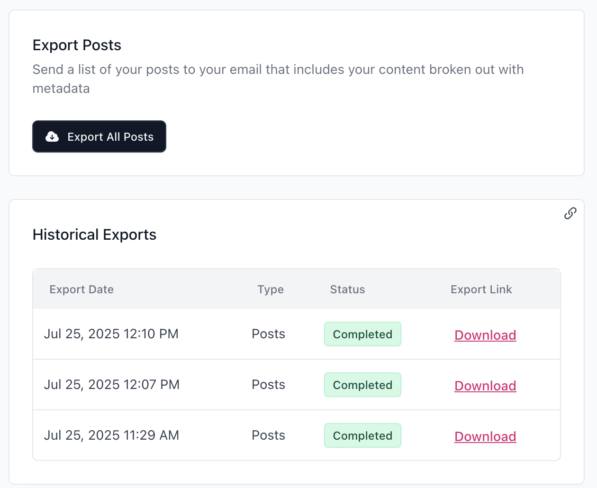

# Algolia - Beehiiv connector

Below are the steps to use this connector. You can skip any steps that you've already done.

1. Create your account at algolia.com and follow the onboarding steps to create an application and index. Save the index name.

1. Click the button in the bottom left corner of the Algolia dashboard that goes to the Settings page, then go to the API Keys tab. Save the Application ID, the Search API Key, and the Write API Key.

1. Click the button below to deploy this app to Netlify. You might have to create an account if you don't have one already. It will ask you to connect to your GitHub account, then input the Application ID, the two API keys, the index name, and the domain of your Beehiiv newsletter website, along with some optional configuration values you don't need to touch if you don't want to.

    [](https://app.netlify.com/start/deploy?repository=https://github.com/jadenguitarman/algolia-beehiiv-connector)

1. Copy the random name Netlify gives your project. It should look something like `spontaneous-taiyaki-1db786`. It might take a few moments, but the app will soon be live at `<project-name>.netlify.app`.

1. Log into your Beehiiv dashboard. Click on the Settings page in the bottom left corner. Go to the Webhooks tab and create two new webhooks, one for new posts and one for post updates. Set the URL destination of both webhooks to `<project-name>.netlify.app/post`.

1. Under the Export Data tab > Export Posts, click the button to generate an export. It'll show up after a little while in the Historical Exports window below. Once it does, download it.

    

1. In a new tab, go to `<project-name>.netlify.app/import-csv`. Upload your Beehiiv post CSV export, and the script will automatically fill the Algolia index with your posts. Unless you specifically asked it not to during the step where you created environment variables, this connector will manage your Algolia settings for you. It'll automatically separate each article section into its own record, but bunch together all the records that were from the same aritcle as one search result using [Deduplication](https://www.algolia.com/doc/guides/managing-results/refine-results/grouping/). Your users will get a cleaner experience of one newsletter issue to one search result, but you'll have the precision and accuracy of a subheading-level search.

1. In the Beehiiv website builder, find the spot where you'd like to place your search integration and add a Custom HTML widget there. Insert this code, swapping in the project name from earlier:

    ```html
    <iframe 
        src="<project-name>.netlify.app/search"
        style="width: 100%; height: 100%; border: 0; outline: 0; margin: 0; padding: 0; flex: 1;"
    ></iframe>
    ```